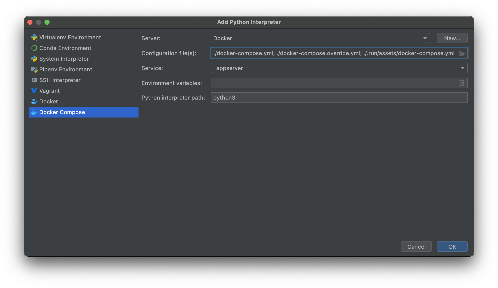

# Motivation 
This folder contains collection of run configurations - to be used within PyCharm IDE.

# Features
+ Visual debugging of Appserver
+ Visual debugging of Client

# First Use
1. Restart PyCharm
2. Setup PyCharm Project Python Interpreter as follows:
   
   
3. Run "Init and populate" configuration. 

# Debugging
1. Run "Init" configuration
2. Run desired debugging option
