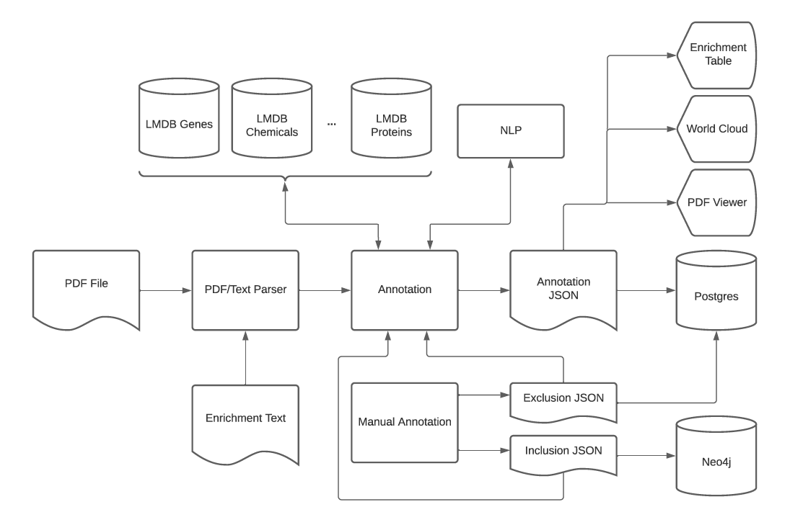

# Annotation Pipeline
This README contains detailed information about the annotation pipeline, e.g architecture, future plans, etc...

## Table of Contents
* [Important Dependencies](#important-dependencies)
* [Creating LMDB Files](#creating-lmdb-files)
* [Architecture](#architecture)
* [The Pipeline](#the-pipeline)
* [Enrichment Annotation](#enrichment-annotation)
* [Manual Annotation](#manual-annotation)
* [NLP Service](#nlp-service)
* [Future Plans](#future-plans)

## Important Dependencies
LMDB: https://github.com/jnwatson/py-lmdb

PDFBox2: https://github.com/SBRG/pdfbox2

PDFParse: https://github.com/SBRG/pdfparse

NLP: https://github.com/biosustain/nlp-api

## Creating LMDB Files
The LMDB files are created from `.tsv` data files, which can be found on GCloud storage bucket: `annotation-data-files/used-in-annotations-pipeline`.

To create them, make sure the `.tsv` files are in `neo4japp/services/annotations/datasets/`, then start the `appserver` container and run the command:
```bash
# create all lmdb files
docker-compose exec appserver flask create-lmdb
# create specific files, acceptable inputs:
# {'Protein', 'Disease', 'Compound', 'Phenotype', 'Pathway', 'Phenomena', 'Chemical', 'Species', 'Anatomy', 'Gene', 'Food'}
docker-compose exec appserver flask create-lmdb --file-type Food
```
Once the files are created, the version number needs to be updated in `neo4japp/lmdb_manager/lmdb_config.json`. This file is used during the deployment to pull the latest LMDB files. The LMDB files will then need to be uploaded to Azure in the correct folder, if a new version then make a new folder for it. The path on Azure is `***ARANGO_DB_NAME*** > File shares > lmdb`, there you will see `v#` folders which is where you will put the LMDB files.

I'm not sure if every function in `neo4japp/lmdb_manager/manager.py` is used (it was written by David B. and used with Ansible), but it does look overly complicated to me. It will probably need to be refactored - there are also JIRA cards to verify it actually works, since we rarely update our LMDB files.

## Architecture


The `Annotation` and `Manual Annotation` processes are within the `appserver` container; there is a JIRA card to separate them out in the future if needed. The `PDF/Text Parser` process is the PDF parser itself, and is a separate docker container written in Java. The `NLP` service is also deployed separately.

## The Pipeline
Because the pipeline involves many steps, it is abstracted away into `class Pipeline` in `neo4japp/services/annotations/pipeline.py`. This is to ensure the steps are called in the correct order.

There might be a better way to do this, but due to time constraints it was done this way.

```python
# example of how to use it
text, parsed = Pipeline.parse(file.mime_type, file_id=file.id, exclude_references=configs['exclude_references'])
pipeline = Pipeline(
  {
    'adbs': get_annotation_db_service,
    'ags': get_annotation_graph_service,
    'aers': get_recognition_service,
    'tkner': get_annotation_tokenizer,
    'as': get_annotation_service,
    'bs': get_bioc_document_service
  }, text=text, parsed=parsed
)
annotations_json = pipeline.get_globals(...).identify(...).annotate(...)
```

### Tokenizing
Since a lot of biological terms are multi-words, Tim suggested a simple brute force approach to make sure we get as many multi-words as possible, lets call it **sequential window scan**.

For each entity, there is a certain max length we allow for the multi-words, so we create a small window and sequentially increment within that window. We then move that window along the text of the document, essentially scanning it.

```bash
# Food has a max length of four
# let's say the sentence is
Today I am going to eat a banana and apple for breakfast.

# tokens produced
Today
Today I
Today I am
Today I am going
I
I am
I am going
I am going to
...
banana
banana and
banana and apple
# and so on
```

### Recognition
The code that uses LMDB to identify entities is in `class EntityRecognitionService`. Apart from Genes and Species, the logic is the same across different entities, so it was grouped together in `def check_lmdb`. Though it is structured in a way that should be easy to separate out into individual functions, much like `def _check_lmdb_genes` and `def _check_lmdb_species`. There were plans to eventually allow users to selectively choose what to annotate, so that can be easily accomplished with the current structure.

### Handling Overlapping Words
Sometimes there are multi-words that share a common word, e.g with the sentence `"foo boo bad"`, it is possible that `"foo boo"` and `"boo bad"` are two entities - these are overlapping words.

Since each word in a PDF document is sequential, we can use their positional index as `intervals` and use an `Interval Tree` to find overlaps. Once overlaps are found, we choose based on entity precedence or if they're the same entities, then we choose the longer term. The entity precedence can be found in `neo4japp/services/annotations/constants.py`, look for `ENTITY_TYPE_PRECEDENCE`.

There were plans to drop this, and allow the user to choose on the UI which words they want, so we might need to remove the interval tree in the future.

## Enrichment Annotation
The enrichment table goes through the same annotation pipeline, but with some extra pre and post processing steps. We want each cell in the enrichment table to be counted as a `"separate paper"`, this is to avoid overlapping words. The overlapping words create an issue because we can potentially lose a word in one cell, because it was part of a longer one in a neighboring cell.

We want each cell to be counted as a separate paper, but we cannot just send an HTTP request to the PDF parser for each cell - this would take too long. So instead, the text in each cell is combined together into one large text string. With this, we only need to send one HTTP request.

Because we combined the cell text together, we need to split them up again later. The mapping used to help do this is created by the `class EnrichmentTableService`. The code to split it back up can be found in `neo4japp/blueprints/annotations.py`, a small snippet is below.

```python
for index, cell_text in enriched.text_index_map:
    annotation_chunk = [anno for anno in sorted_annotations_list if anno.get(
        'hiLocationOffset', None) and anno.get('hiLocationOffset') <= index]
    # it's sorted so we can do this to make the list shorter every iteration
    sorted_annotations_list = sorted_annotations_list[len(annotation_chunk):]

    for anno in annotation_chunk:
        if prev_index != -1:
            # only do this for subsequent cells b/c
            # first cell will always have the correct index
            # update index offset to be relative to the cell again
            # since they're relative to the combined text
            anno['loLocationOffset'] = anno['loLocationOffset'] - (prev_index + 1) - 1  # noqa
            anno['hiLocationOffset'] = anno['loLocationOffset'] + anno['keywordLength'] - 1  # noqa
```
This code snippet recalculates the positional index so it is independent of text in other cells and relative to its own cell. It is important to recalculate these because they are used to correctly identify and highlight words in the enrichment table.

### Highlighting Enrichment Words
Unlike the PDF viewer, the enrichment table has no way to identify words (PDF viewer uses coordinates). The original approach was to use a regex text search, but this was not accurate and very slow for large enrichment tables. It was reworked into using the index offsets to correctly get the words to highlight. The code for this is in `def _highlight_annotations` and would need to be abstracted away into a class in the future.

## Manual Annotation
A local inclusion/exclusion is local to the specific PDF it was made in.

A global inclusion/exclusion is **both** a local and a global.

Local inclusions/exclusions are stored in Postgres, as well as global exclusions. The locals are saved in the `files` table, while the globals are in `global_list`.

The global inclusions are stored in Neo4j under the label `:GlobalInclusion` if they do not map to any existing nodes, otherwise use that existing node and create a new synonym relationship with it.

Because we do not curate before they're added to Neo4j, a user can potentially create a bad global inclusion. To correctly delete, we need the property `original_entity_types` so we don't accidentally delete the wrong thing.

## NLP Service
The NLP is deployed separately, and is an optional choice in the annotation pipeline. It currently only supports Gene, Chemical and Disease.

We do not use the NLP to `"identify"` entities, but more as a validating veto.

What this means is, let's say NLP identified the word `ydhC` as a gene, we do not automatically agree and say it's a gene. We look in LMDB first and if we find it in LMDB as a gene, then we now have `"two yes"` that `yhdC` is a gene, so we are more confident and say it's a gene. But if we do not find it in LMDB as a gene, then we discard the NLP results for it.

## Future Plans
As with the entire application, the annotation pipeline is synchronous which is a big limitation. We can possibly alleviate these limitations with the two JIRA cards below.

[JIRA LL-3047: Separate Annotation Service](https://sbrgsoftware.atlassian.net/browse/LL-3047): Separating out into a separate container can help us manage resources better between the containers.

[JIRA LL-2085: Task Queue](https://sbrgsoftware.atlassian.net/browse/LL-2085): A task queue will help with PDFs that are large and take time to annotate (with NLP involved, this will take much longer). Through QA testing, NLP has been shown to be twice as slow compared to only using the annotation pipeline. So if we combine both, there is a big performance hit. Apply task queue to both annotating and re-annotating.
