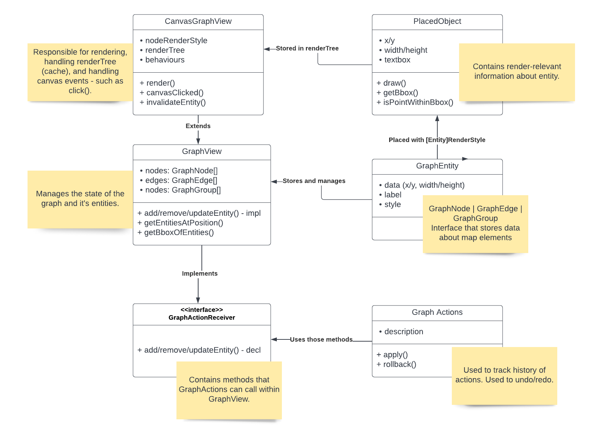

# Graph Viewer and Editor

This collection of files implements a framework for a graph editor and viewer.

```typescript
const style = new KnowledgeMapStyle();
const graphCanvas = new CanvasGraphView(canvasTag, {
  nodeRenderStyle: style,
  edgeRenderStyle: style,
  groupRenderStyle: style,
});
graphCanvas.behaviors.add('delete-keyboard-shortcut', new DeleteKeyboardShortcut(graphCanvas), -100);
// ... more behaviors...
graphCanvas.backgroundFill = '#f2f2f2';
graphCanvas.startParentFillResizeListener();
graphCanvas.startAnimationLoop(); // Note: If calling from Angular, call outside Angular with ngZone

// When done:
graphCanvas.destroy();
```

## Reference
* Graph - information about state of the map and its component. Basically a parsed version of `graph.json` file from map content.
* Graph Entity - umbrella term for all types of map components - current `nodes | edges | groups`.
* Placed Object - boiled down representation of `Entity` responsible for storing information relevant for
the rendering process - as well as the `draw()` function itself.
* Action - encapsulation of user actions that allow to undo/redo itself. Used for tracking the history of edition in order to implement
those (undo/redo) mechanism
* Behaviour - responsible for handling events from user, such as dragging/clicking of the canvas/entities.


## UML


## Organization

* [renderers/](renderers) - The renderers themselves and the starting point of all this code
  * [graph-view](renderers/graph-view.ts) - Responsible for management of the graph itself. The functions here affects the state of 
  the `graph` rather than rendering itself. Implements the code responsible for the graph manipulation via `GraphAction`.
  * [canvas/canvas-graph-view.ts](renderers/canvas/canvas-graph-view.ts) - Extends `graph-view` with
  code responsible for drawing on the canvas. Stores the render information in `[Entity name]RenderStyle`
  objects. Responsible for placing the objects and managing the render cache.
  Responsible for handling canvas events (click/drag, etc.) and calling behaviours.
  * [canvas/renderTree.ts](renderers/canvas/render-tree.ts) - cache storing information about placed objects.
  * [behaviours](renderers/canvas/behaviors) - Responsible for reacting to the canvas events (mouse/key click, drag, etc.)
  
* [styles/](styles) - Renderers use style objects to convert graph data into drawing primitives that
    have metrics (width, height, bbox) and draw() methods - placed objects.
* [actions/](actions) - `Actions` abstract user-initiated *actions* so they can be rolled back or redone --
    when you need to record something the user did, create an action and call `renderer.execute(action)`.
Actions affecting multiple entities can be stored together in a group action - `Compound Action`. In order to enable
method to be called from `GraphAction`, its prototype should be added to `GraphActionReceiver` class, which is implement
by the `graph-view` class (and implemented there).
* [utils/](utils) - Utility methods used by the graph viewer.
    * [canvas/](utils/canvas) - Stores the class files for `PlacedObject`. 

## Todo

* [ ] Improve performance to the point that we can render 1,000,000 nodes (or at least a LOT)
    * [x] Automatically decide when to not draw text (text rendering is extremely expensive)
    * [ ] Automatically decide when to not draw round node corners (`arc()` is a little expensive)
    * [ ] Cache word wrapping results as much as possible in `TextElement` (text metrics are expensive)
    * [ ] Consider drawing nodes onto off-screen canvases in `PlacedNode` and `PlacedEdge` and then
        copying those canvases onto the main canvas when draw() is called for maximum performance
    * [ ] Minimize PlaceNode/PlacedEdge cache invalidation caused by some operations
    * [ ] When zooming or panning, take a screenshot of the canvas and manipulate that, waiting to
        re-draw the whole canvas when zooming has completed
    * [ ] Only re-draw changed portions of the canvas when changing graph data (currently possible!
        we have bboxes)
    * [ ] Only re-draw new portions of the canvas when panning
    * [ ] Use a spatial index or culling to make `getEntityAtMouse()` fast as possible

* [] Improve drawing mechanism
  * [] Add the selection as last part of the drawing, rather than drawing under the nodes/edges
  * [] Allow users to choose Z-index of the entities.