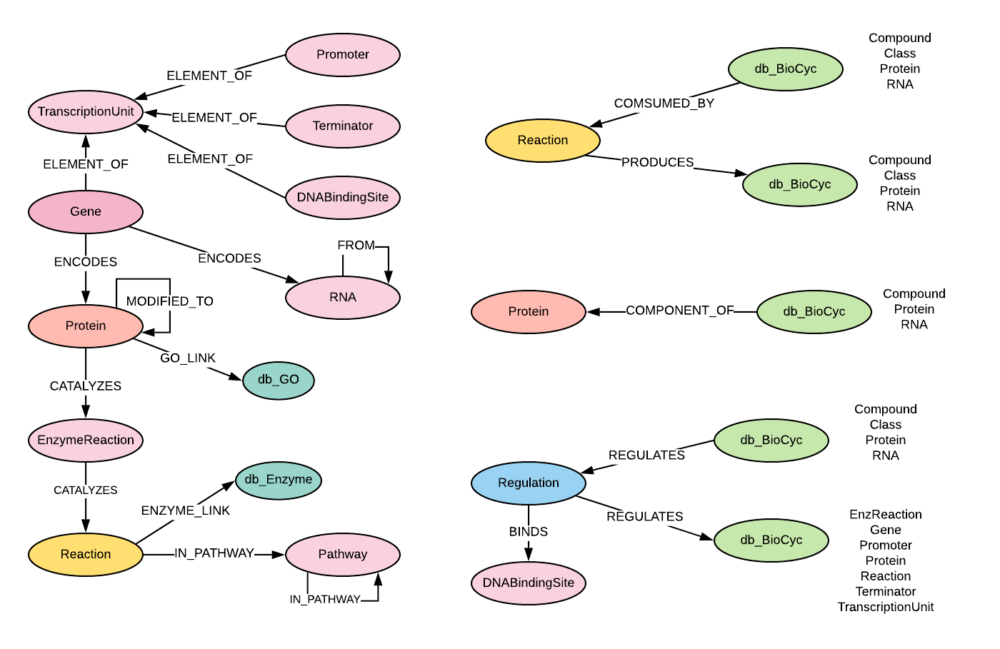

# BioCyc Spec for Knowledge Graph
The BioCyc database collection is an assortment of organism specific Pathway/ Genome Databases (PGDBs). They provide 
reference to genome and metabolic pathway information for thousands of organisms. 
Download site: https://brg-files.ai.sri.com/public/dist/.  Search for the specific organism data for download.

Currently we loaded the following databases:
- EcoCyc:  Escherichia coli K-12 substr. MG1655 (tax_id 511145)  
http://brg-files.ai.sri.com/public/dist/ecoli.tar.gz

- HumanCyc: Homo sapiens  (tax_id 9606)  
http://brg-files.ai.sri.com/public/dist/human.tar.gz

- YeastCyc: Saccharomyces cerevisiae S288C (tax_id 559292)   
http://brg-files.ai.sri.com/public/dist/yeastcyc.tar.gz

- PseudomonasCyc: for Pseudomonas putida KT2440 (tax_id 160488)  
http://brg-files.ai.sri.com/public/dist/pput160488cyc.tar.gz

In Lifelike graph database, each node in BioCyc was labeled as db_BioCyc, and nodes for each biocyc database was 
labeled as additional database name, such as db_EcoCyc, db_HumanCyc.  Therefore for any EcoCyc, there are 3 labels: 
db_BioCyc, db_EcoCyc and the entity name (e.g. Gene, Protein)

### Graph database schema for BioCyc 

#### Node labels and attributes:   
id has the same value for biocyc_id, and displayName and pathways attributes were added post-loading for annotation

| Node Label | Attribute|      
|-----:|-----------:|        
| Class | biocyc_id |	
| Class | data_source |	
| Class | displayName |	
| Class | id |	
| Class | name |	
| Class | synonyms |	
| Compound | abbrev_name |	
| Compound | biocyc_id |	
| Compound | data_source |	
| Compound | displayName |	
| Compound | id |	
| Compound | inchi_key |	
| Compound | name |	
| DNABindingSite | abs_center_pos |	
| DNABindingSite | biocyc_id |	
| DNABindingSite | description |	
| DNABindingSite | displayName |	
| DNABindingSite | id |	
| DNABindingSite | site_length |	
| EnzReaction | biocyc_id |	
| EnzReaction | description |	
| EnzReaction | displayName |	
| EnzReaction | genes |	
| EnzReaction | id |	
| EnzReaction | name |	
| Gene | accession |	
| Gene | biocyc_id |	
| Gene | description |	
| Gene | displayName |	
| Gene | id |	
| Gene | left_end_position |	
| Gene | name |	
| Gene | pathways |	
| Gene | right_end_position |	
| Gene | strand |	
| Pathway | biocyc_id |	
| Pathway | displayName |	
| Pathway | genes |	
| Pathway | id |	
| Pathway | name |	
| Promoter | biocyc_id |	
| Promoter | description |	
| Promoter | displayName |	
| Promoter | genes |	
| Promoter | id |	
| Promoter | name |	
| Promoter | pos_1 |	
| Promoter | strand |	
| Protein | abbrev_name |	
| Protein | biocyc_id |	
| Protein | description |	
| Protein | displayName |	
| Protein | genes |	
| Protein | id |	
| Protein | molecular_weight_kd |	
| Protein | name |	
| Protein | pi |	
| RNA | abbrev_name |	
| RNA | biocyc_id |	
| RNA | description |	
| RNA | displayName |	
| RNA | genes |	
| RNA | id |	
| RNA | location |	
| RNA | name |	
| Reaction | biocyc_id |	
| Reaction | description |	
| Reaction | displayName |	
| Reaction | ec_number |	
| Reaction | id |	
| Reaction | name |	
| Regulation | biocyc_id |	
| Regulation | displayName |	
| Regulation | id |	
| Regulation | mechanism |	
| Regulation | mode |	
| Regulation | type |	
| Terminator | biocyc_id |	
| Terminator | description |	
| Terminator | genes |	
| Terminator | id |	
| Terminator | left_end_position |	
| Terminator | right_end_position |	
| TranscriptionUnit | biocyc_id |	
| TranscriptionUnit | description |	
| TranscriptionUnit | displayName |	
| TranscriptionUnit | genes |	
| TranscriptionUnit | id |	
| TranscriptionUnit | name |	

#### Node outgoing relationships

| StartNode | Relationship | EndNode | Cardinality |   
|-----:|-----------:|-----:|-----------:|         
| Class | CHEBI_LINK | Chemical | 1 |	
| Class | COMPONENT_OF | Protein | + |	
| Class | CONSUMED_BY | Reaction | + |	
| Class | HAS_SYNONYM | Synonym | + |	
| Class | REGULATES | Regulation | + |	
| Class | TYPE_OF | Class | + |	
| Compound | CHEBI_LINK | Chemical | 1 |	
| Compound | COMPONENT_OF | Protein | + |	
| Compound | CONSUMED_BY | Reaction | + |	
| Compound | HAS_SYNONYM | Synonym | + |	
| Compound | REGULATES | Regulation | + |	
| Compound | TYPE_OF | Class | + |	
| DNABindingSite | ELEMENT_OF | TranscriptionUnit | 1 |	
| EnzReaction | CATALYZES | Reaction | 1 |	
| EnzReaction | HAS_SYNONYM | Synonym | + |	
| Gene | ELEMENT_OF | TranscriptionUnit | 1 |	
| Gene | ENCODES | Protein | 1 |	
| Gene | ENCODES | RNA | 1 |	
| Gene | HAS_SYNONYM | Synonym | + |	
| Gene | IS | db_NCBI Gene | 1 |	
| Pathway | HAS_SYNONYM | Synonym | + |	
| Pathway | IN_PATHWAY | Pathway | 1 |	
| Pathway | TYPE_OF | Class | + |	
| Promoter | ELEMENT_OF | TranscriptionUnit | 1 |	
| Promoter | HAS_SYNONYM | Synonym | + |	
| Protein | CATALYZES | EnzReaction | + |	
| Protein | COMPONENT_OF | Protein | + |	
| Protein | CONSUMED_BY | Reaction | + |	
| Protein | GO_LINK | db_GO | + |		
| Protein | HAS_SYNONYM | Synonym | + |	
| Protein | MODIFIED_TO | Protein | + |	
| Protein | REGULATES | Regulation | + |	
| Protein | TYPE_OF | Class | + |	
| RNA | COMPONENT_OF | Protein | + |	
| RNA | CONSUMED_BY | Reaction | + |	
| RNA | HAS_SYNONYM | Synonym | + |	
| RNA | MODIFIED_TO | RNA | + |	
| RNA | REGULATES | Regulation | + |	
| RNA | TYPE_OF | Class | + |	
| Reaction | ENZYME_LINK | EC_Number | + |	
| Reaction | HAS_SYNONYM | Synonym | + |	
| Reaction | IN_PATHWAY | Pathway | + |	
| Reaction | PRODUCES | Class | + |	
| Reaction | PRODUCES | Compound | + |	
| Reaction | PRODUCES | Protein | + |	
| Reaction | TYPE_OF | Class | + |	
| Regulation | BINDS | DNABindingSite | 1 |	
| Regulation | REGULATES | EnzReaction | 1 |	
| Regulation | REGULATES | Gene | 1 |	
| Regulation | REGULATES | Promoter | 1 |	
| Regulation | REGULATES | Protein | 1 |	
| Regulation | REGULATES | Reaction | 1 |	
| Regulation | REGULATES | Terminator | 1 |	
| Regulation | REGULATES | TranscriptionUnit | 1 |	
| Regulation | TYPE_OF | Class | + |	
| Terminator | ELEMENT_OF | TranscriptionUnit | 1 |	
| TranscriptionUnit | HAS_SYNONYM | Synonym | + |	

