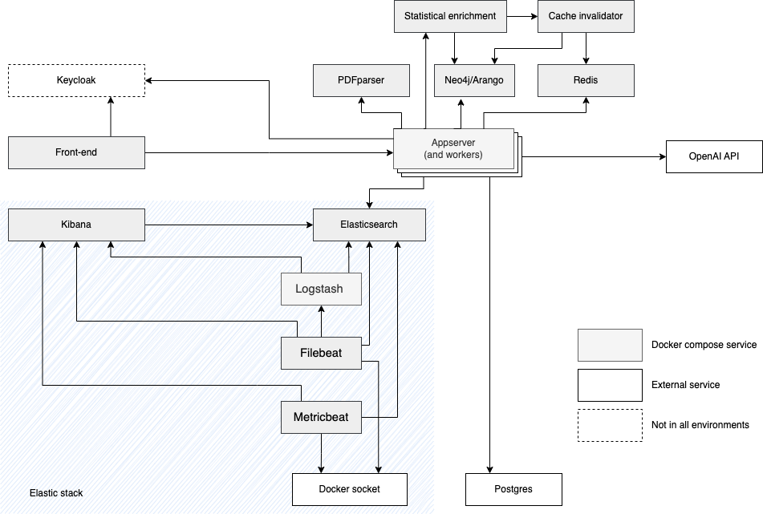

# Architecture overview

<small>NOTE: The diagram is created with [draw.io](https://draw.io), this is editable version (copy of diagram has been embedded into the file).</small>

# Service functional groups
## Authentication
Authentication related code is deposited in Front-end and appserver. Additionally, in publish enviroment keycloak is used as OAuth2 provider.

## Annotation
Annotation steps rely on Front-end, appserver, pdfparser, redis, postgress and graph database. 
Only two types of files are annotateble: PDF and enrichment table.

In principle annotation pipeline works as follows for PDF files:
1. Front-end sends request to appserver to annotate file.
2. Appserver sends request to pdfparser to extract words and their locations.
3. Load core annotation terms into LMDB
4. Load annotation inclusions from graph database
5. Load annotation exclusions from postgress
6. Search for match between words and annotation terms
7. Matches are structured into json annotation structure
8. JSON annotation structure save to postgress is scheduled to redis queque
   1. Worker process reads annotation structure from redis queque and saves it to postgress
9. Appserver returns response (to request from pt. 1) with annotation structure
10. Front-end renders annotations

In case of enrichment table, the process is similar:
1. Front-end sends request to appserver to annotate enrichment table.
2. Enrichment table is stringified to text
3. Appserver sends request to pdfparser to extract words from text and their locations.
4. Load core annotation terms into LMDB
5. Load annotation inclusions from graph database
6. Load annotation exclusions from postgress
7. Search for match between words and annotation terms
8. Matches are structured into json annotation structure
9. JSON annotation structure save to postgress is scheduled to redis queque
   1. Worker process reads annotation structure from redis queque and saves it to postgress
10. annotation structure is translated into json table structure containing xml snippets for annotations
11. Appserver returns response (to request from pt. 1) with json table structure containing xml snippets for annotations
12. Front-end overwrites enrichment table with xml snippets for annotations
13. Front-end renders annotations
14. Front-end sends request to appserver to save enrichment table
15. Appserver schedules saving enrichment table to postgress
    15.1. Worker process reads enrichment table from redis queque and saves it to postgress

## Search/Indexing
Search and indexing steps rely on Front-end, appserver, postgress and elasticsearch.

In appserver code upon each modification to file:
1. Redis queque task is scheduled to reindex file
   1. Worker process reads file content from redis queque
   2. File content is parsed into text
   3. Text is send to elasticsearch for indexing

In case of search request is simply send to elasticsearch and results are returned to front-end.

## Enrichment (table)
Enrichment table relies on Front-end, appserver, postgress and graph database.

1. Front-end sends request to appserver to enrich gene list.
2. Appserver sends request to graph database to get related gene information.
3. Appserver returns response (to request from pt. 1) with gene information.
4. Front-end composes request from step 1 and gene information into enrichment file.
5. Front-end sends request to appserver to save enrichment file.
6. Front-end send annotation request.

## Statistical enrichment
Statistical enrichment relies on Front-end, appserver, redis, graph database and statistical enrichment container.

1. Front-end sends request to appserver to perform statistical enrichment.
2. Appserver forwards request to statistical enrichment container to perform statistical enrichment.
3. Statistical enrichment checks if any part of input data or whole request is in redis cache.
4. In case of cache hit, statistical enrichment returns results from cache.
Alternatively, we query missing input data from graph database and perform statistical enrichment (caching both intermidiate steps and final results).
5. Statistical enrichment returns results to appserver.
6. Appserver returns results to front-end.
7. Front-end renders results.

# Services in detail
## Front-end
[Source code](https://github.com/SBRG/kg-prototypes/tree/master/client)
[Source code welcome page](https://github.com/SBRG/***ARANGO_DB_NAME***-website)

## Appserver
[Source code](https://github.com/SBRG/kg-prototypes/tree/master/appserver)

## PDF parser
[Source code](https://github.com/SBRG/pdfparse)
[Source code pdfbox2](https://github.com/SBRG/pdfbox2)

## Elasticsearch
[Source code](https://github.com/SBRG/kg-prototypes/tree/master/elasticsearch)

## Graph database
[Source code neo4j](https://github.com/SBRG/kg-prototypes/tree/master/neo4j)
[Source code arango](https://github.com/SBRG/kg-prototypes/tree/master/arango)

## Keycloak
[Source code](https://github.com/SBRG/***ARANGO_DB_NAME***-keycloak)

## Cache-invalidator
[Source code](https://github.com/SBRG/kg-prototypes/tree/master/cache-invalidator)

